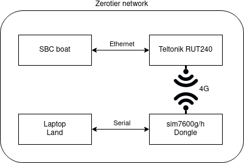

# Global LAN using Zerotier

The following manual will describe how to setup communication between boat and land through 4G cellular network, see [fig 1](#Global-LAN/network-autosail.png).

Follow attached guide to setup Zerotier Network and adding clients and server, see "ZeroTier configuration - Teltonika Networks Wiki.html".

## Join a Network on Linux PC

### 1. Install zerotier-cli

Copy phase following curl command into linux terminal

> curl -s 'https://pgp.mit.edu/pks/lookup?op=get&search=0x1657198823E52A61' | gpg --import && \ if z=$(curl -s 'https://install.zerotier.com/' | gpg); then echo "$z" | sudo bash; fi

### 2. Join Zerotier network on PC

1. Copy network_id from [https://my.zerotier.com/](https://my.zerotier.com/)

2. Paste network_id into command

> zerotier-cli join (network_id)

Done
