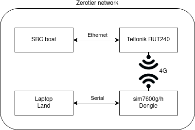

# Global LAN using Zerotier

The following manual will describe how to setup communication between boat and land through 4G cellular network, see [fig 1](#Global-LAN/network-autosail.png).

Follow attached guide to create an account and set up a Zerotier Network and adding clients and server, see "ZeroTier configuration - Teltonika Networks Wiki.html".

## Initial setup if no setup exists

(Note that this will factory reset the router)

1. Pull **all** ethernet cables from  RUTxxx except for the PC that will configure the router.

2. Turn router around and press factory reset until all 5 wifi signal bars are lit up.

3. Go to [https://192.168.1.1](https://192.168.1.1).

4. Sign in using: user = admin, passwd=admin01.

5. Change passwd.

6. Continue with setup wizard

7. Change from 192.168.1.1 to 192.168.*.1 to avoid local issues with other routers.

8. Continue until finished setup wizard .

9. Plug in ethernet cable to enable downloading packages.

10. Change BASIC router mode to ADVANCED (depending on the router) .

11. Follow attached guide to create an account and set up a Zerotier Network and adding clients and server, see "ZeroTier configuration - Teltonika Networks Wiki.html".

**Note:** Please login using autosail-mdh github, login information to github can be found in microsoft teams.

## Existing setup

1. Go to: [https://my.zerotier.com/](https://my.zerotier.com/)
2. Sign in using autosail-mdh github
3. Check existing networks, continue to add/remove clients if needed.

## Join a Network on Linux PC

### 1. Install zerotier-cli

The following curl command will install zerotier if used in a linux terminal

    > curl -s 'https://pgp.mit.edu/pks/lookup?op=get&search=0x1657198823E52A61' | gpg --import && \ if z=$(curl -s 'https://install.zerotier.com/' | gpg); then echo "$z" | sudo bash; fi

### 2. Join Zerotier network on PC

1. The network_id can be found at [https://my.zerotier.com/](https://my.zerotier.com/)

2. Then use the following command in terminal

    > zerotier-cli join <network_id>

## SSH into network

Note: To SSH between machines both machines must join zerotier network to be able to SSH.

1. Take ip-addresses from either [https://my.zerotier.com/](https://my.zerotier.com/) or type "ip a" to show ip address on target unit.

2. Open terminal & type: ssh target_username@<zerotier_ipadress_goes_here>,
add fingerprint and enter password
